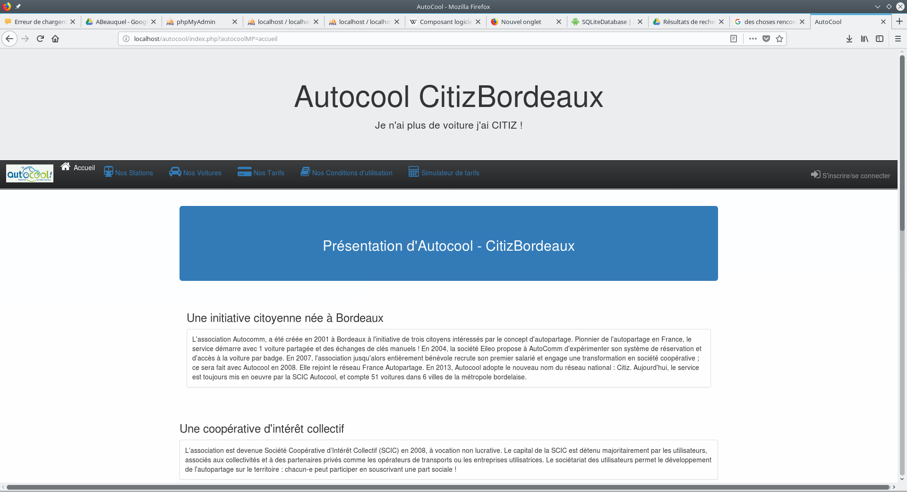

Projet de cours ayant pour but de créer un site web similaire à https://bordeaux.citiz.coop/.
Un site web alliant gestion pour les employés (back office) et les clients (front office). Dans un groupe
de 3, je me suis occupé de la partie du technicien. Il pouvait ajouter supprimer toutes les informations
sur les véhicules et les stationnements. 

L'application web a été faite en php avec une base de données MySql. Pour le css j'ai
utilisé Boostrap 3.0. 

  <hidden>
    
    
  </hidden>
  <zoom-image src='projet6.png' zoomSrc='projet6.png' ></zoom-image>

