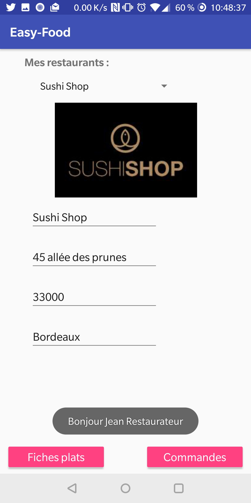

L'application utilise une base de données SQLLite.

##Cahier des charges EasyFood Android

1- A propos de easyFood :

EasyFood est un service de commentaire pour la livraison de repas. Les abonnés, les restaurateurs et les employés de la société EasyFood disposent quasiment tous d’un smartphone ou d’une tablette sous Android. Les applications développées dans le cadre de ce projet ne sont qu'une ébauché des applications finales. A terme, une synchronisation des données aura lieu entre les bases mobiles, et la base de données centrale d'EasyFood.
 
Les objectifs fixés dans ce contexte sont d'accéder, visualiser et modifier des informations stockées dans
une base de données embarquée. Trois besoins ont été exprimés, que ce soit au niveau des abonnés ou des
personnels de la société EasyFood :
- les clients peuvent consulter la liste de leurs commandes, puis afficher les plats liés. Une fois les plats
livrés et mangés, ils peuvent poster un commentaire sur chaque plat lié et laisser une évaluation sur le
restaurant.
- les restaurateurs peuvent accéder aux commandes de plats passées pour leur restaurants lors de la
préparation des commandes. De plus, ils peuvent modifier une fiche plat si besoin.
- les modérateurs souhaitent pouvoir contrôler et valider les commentaires des clients sur les plats et les
évaluations des restaurants.
Pour ces trois axes, l’affichage devra être réalisé sur un même principe :
Affichage d’une liste principale, et, sur sélection d’un élément de la liste, affichage de la « sous liste ». Les
informations à afficher et à modifier sont enregistrées dans une base de données SQLite pouvant être une
vue partielle de la base de données serveur.
Chaque affichage fera l’objet d’un développement spécifique réalisé par un membre du groupe.

2- Cahier des charges technique

Chaque affichage fera l'objet d'une mission distincte, et la réalisation de chacune d'elle nécessite les phases
suivantes :

* Analyse du MEA global fourni en annexe, et création du schéma de base minimal
* Création des occurrences
* Mise en place des classes permettant l'accès aux données
* Création des interfaces graphiques
* Utilisation de composants graphiques adaptés (adapter, spinner, switch...)

  <hidden>
    
    
  </hidden>
  <zoom-image src='projet8.png' zoomSrc='projet8.png' ></zoom-image>

