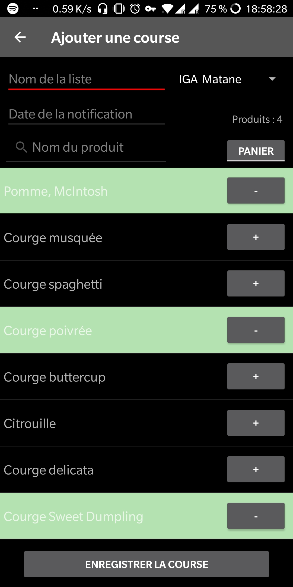
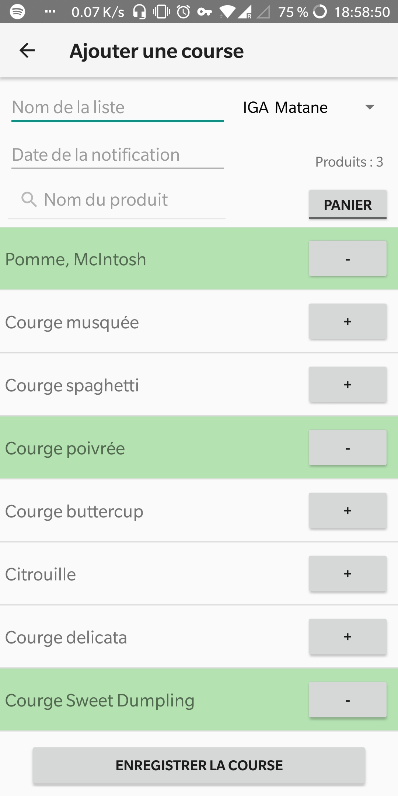
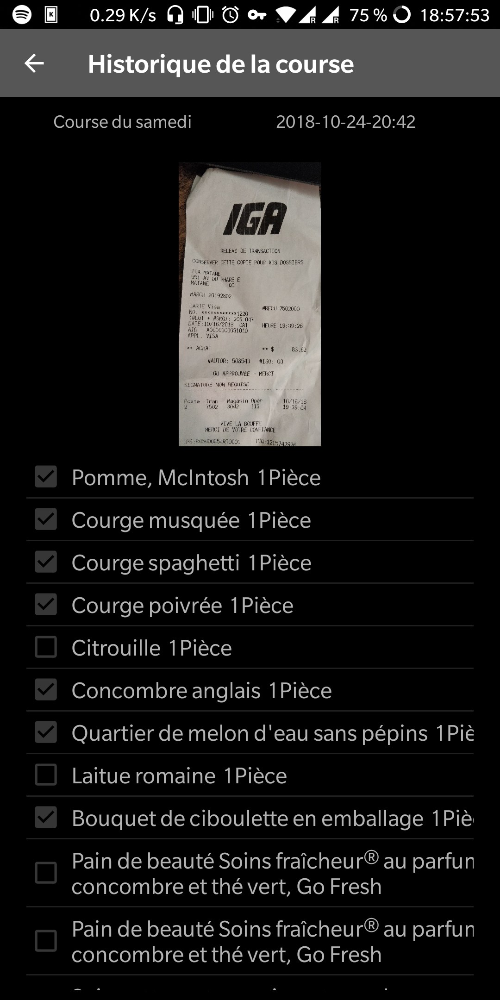

Fonctionnalités : 
  <li>Sauvegarder des listes de courses</li>
  <li>Historiser les listes, avec une sauvegarder des produits achetés et une photo du ticket de caisse</li>
  <li>Lié une course à un Magasin et l'afficher sur une carte google maps</li>
  <li>Base de données de 5000 produits</li>   
  <li>Notification pour une liste de course</li>
  <li>Gestion de théme (basique, sombre, lumineux)</li>

 
 

Ajout d'une course

  <hidden style="width: 50%;">
    
    
  </hidden>
  <zoom-image src='ajouter_course.jpg' zoomSrc='ajouter_course.jpg' ></zoom-image>

Ajout d'une course avec theme lumineux: 

  <hidden>
    
    
  </hidden>
  <zoom-image src='ajouter_course_lumineux.jpg' zoomSrc='ajouter_course_lumineux.jpg' ></zoom-image>

Affichage d'une ancienne course 

  <hidden>
    
    
  </hidden>
  <zoom-image src='liste_historique.jpg' zoomSrc='liste_historique.jpg' ></zoom-image>

