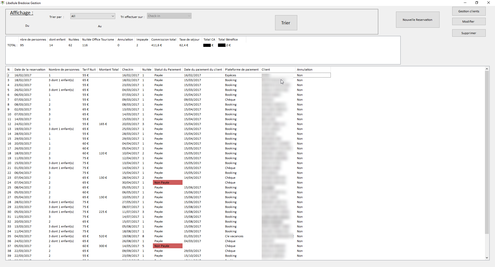

###À propos de la libellule Brédoise 

La libellule brédoise est une chambre d’hôte possédant une seule chambre. Les réservations se font à de
plusieurs façons à travers des plateformes tel que Booking ou Clé Vacances mais aussi parfois en direct.
La gestion actuel se fait en utilisant le Back office proposer par Booking, un tableau Excel. L’agenda est
géré par un channel manager faisant le lien entre les différentes plateformes.

  <hidden>
    
    
  </hidden>
  <zoom-image src='projet1.png' zoomSrc='projet1.png' alt='Image libellule brédoise'></zoom-image>

### Cahier des charges de l'application

**Fonctionnalités :**

On distingue deux notions à sauvegarder, la notion de client et de réservation. Sachant que chaque réservation doit être liée à un client.
Pour la notion de client, il doit être possible de renseigner un nom, un e-mail, un téléphone, un pays et  une région de provenance. Ainsi que la langue principalement parlée, afin de prévoir certains difficultés de transport ou de communication. Certains clients peuvent avoir le statut Génius et disposer de certains avantages.  Il est nécessaire de pouvoir Ajouter, modifier, supprimer un client.

Pour la notion de réservation, elles possèdent toutes obligatoirement : 

 * une date de reçu de la réservation (la date de la réservation du client)
 * une date de Check-in
 * le nombres de nuitées ( la durée de la réservation)
 * le nombre de personne souhaitant dormir ( distinguer le nombre d’enfant pour la taxe de séjour)
 * la plateforme sur laquelle la réservation a été faite ( Booking, CléVacances ou autre pour le moment)
 
De plus est aussi important de savoir si la personne a payé la réservation, une fois réglé, il faudra sauvegarder la date du paiement. Un client peut annuler la réservation, une réservation annulé doit rester sauvegardée. Il est nécessaire de pouvoir ajouter, modifier, supprimer une réservation.

Afficher un tableau de bord des réservations.
      
**Demande sur l’interface**

Afficher un tableau de bord des réservations :
toutes les information que contient une réservation mais aussi le nom de son client. 

Distinguer graphiquement :
    * L’annulation d’une réservation
    * Une réservation non payée
    * Un client genius

Tri du tableau de bord :
* Doit pouvoir trier les réservations par ordre chronologique, sur les trois dates possible (choix dans l’interface)
* Choisir la date de début et la date de fin du tri
* Par défaut il doit être possible de de sélectionner des choix de date tel que l’année actuelle, le mois actuel, la semaine actuelle
* Par défaut à l’ouverture l’application doit afficher le tableau de bord sur l’année actuelle

Le tableau de bord trié doit afficher des chiffres globals pour toutes les réservations correspondant au tri sélectionné.
Ce tableau de bord global doit afficher : 
* Le nombre total de personnes venu ( distinguer les enfants)
* Le nombre de d’annulations
* le nombre de réservations non payées
* le nombre de nuitées
* le nombre de nuitées pour l’office du tourisme ( 1 nuitée = 1personne adulte, 1 nuit)
* la commission total prix par les plateformes pour les réservations ( booking 15 %, cle vacance 5%)
* le total des taxe de séjour (0,60€ par nuité office du tourisme)
* Le chiffre d’affaire total 
* le bénéfice total (CA -(commission )

