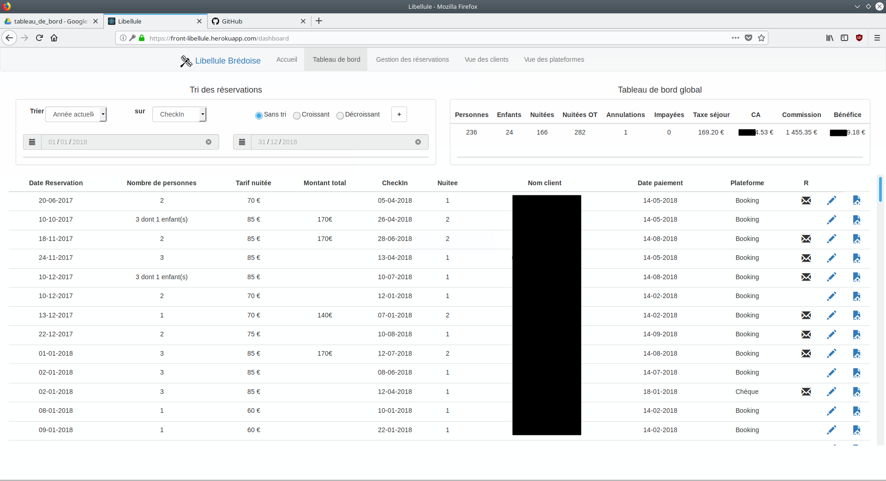

###À propos de la libellule Brédoise 

La libellule brédoise est une chambre d’hôte possédant une seule chambre. Les réservations se font à de
plusieurs façons à travers des plateformes tel que Booking ou Clé Vacances mais aussi parfois en direct.
La gestion actuel se fait en utilisant le Back office proposer par Booking, un tableau Excel. L’agenda est
géré par un channel manager faisant le lien entre les différentes plateformes.

### Cahier des charges de l'application

Fontionnalités de l'application web :
- Avoir un accès web et mobile (dans un premier temps le site sera responsive, et par la suite sera développer une application mobile)
- Respecter les demandes du cahier des charges précédent pour la libellule brédoise client lourd
- Système d’authentification pour restreindre l’accès aux données
- Récupérer les données de la base de données précédente.

Demandes supplémentaires : 

- Séparer la notion de plateforme de réservation des réservations pour pouvoir gérer plus facilement l’ajout d’une nouvelle plateforme ou la modification du taux de commission de cette plateforme.

La partie client de l'application est en ReactJs hébergé sur heroku. Cette dernière est relié a une API en 
php (Symfony) hébergé sur OVH avec une base de données MySQL sur le même serveur.

Tableau de bord de l'application

  <hidden>
    
    
  </hidden>
  <zoom-image src='tableau_de_bord.png' zoomSrc='tableau_de_bord.png' alt='Image libellule brédoise'></zoom-image>

