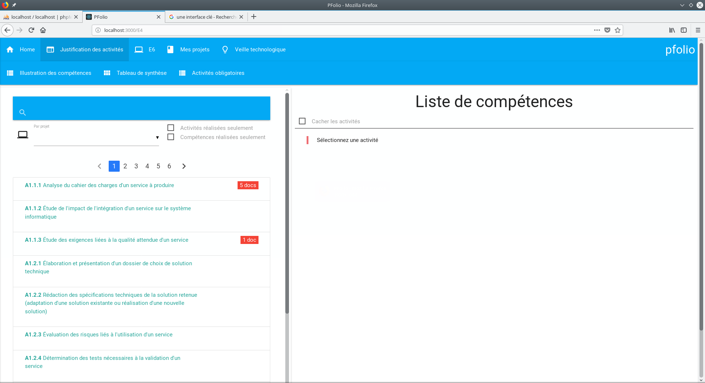

Création d'un portfolio afin de montrer mes compétences par rapport au référenciel officel du BTS.
 apprise durant mes deux années de BTS. J'ai réalisé en React js avec une API en php pour valider l'apprentissage
du langage utilisé durant mon stage de deuxiéme année. 
Pour le css j'ai utilisé <a href="https://materializecss.com/">Materialize</a>.

Lien du site (attente de 10 sec le temps que le serveur s'allume): https://abeauquel-pfolio.herokuapp.com/

  <hidden>
    
    
  </hidden>
  <zoom-image src='projet3.png' zoomSrc='projet3.png' ></zoom-image>

