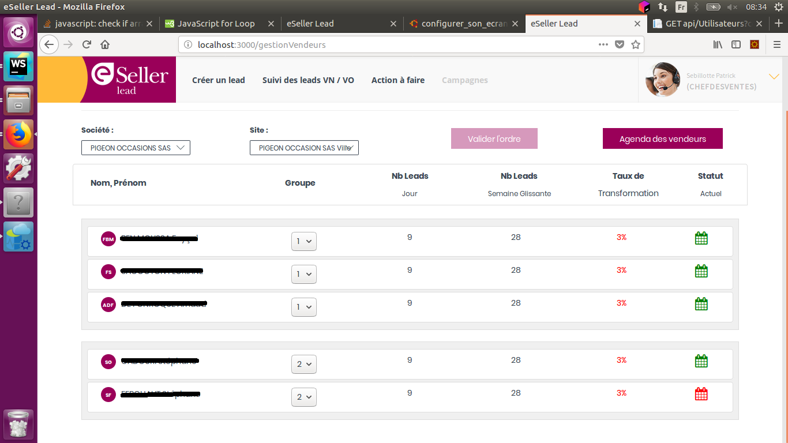

Durant mon stage de 2éme année j'ai eu l'occasion de travailler sur ce projet pendant 2 mois. 
Je me suis occupé d'une d'une fonctionnalité pour gérer l'ordre d'arrivé des leads générés par les clients 
vers les commerciaux. Cet ordre est géré par le manager des commerciaux.

  <hidden>
    
    
  </hidden>
  <zoom-image src='projet4.png' zoomSrc='projet4.png' ></zoom-image>

