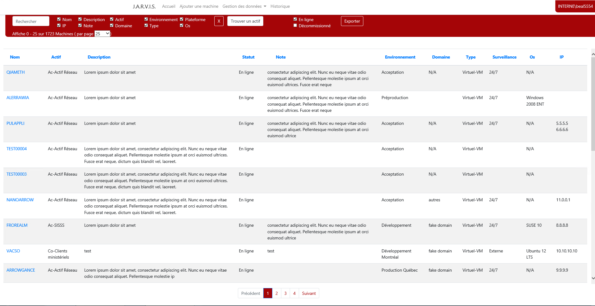

Durant mon stage de fin de DEC j'ai eu l'occasion de travailler sur ce projet pendant 6 mois. Le but du projet est de remplacer l'ancien outil d'inventaire vieux de 20 ans. Le nouvel outil devait reprendre les même fonctionnalités tout ouvrant les données avec une API pour pouvoir développer des automatismes. Comme du montage ou la configuration de serveur virtuel.
J'ai été autonome sur la partie de technique de l'application.

  <hidden>
    
    
  </hidden>
  <zoom-image src='accueil1.PNG' zoomSrc='accueil1.PNG' ></zoom-image>

Lors de ce stage j'ai pu découvrir le monde du déploiement tout en restant développeur. J'ai cotoyé des machines virtuelles, un active directory, des scripts powershell, de la configuration de machine. 